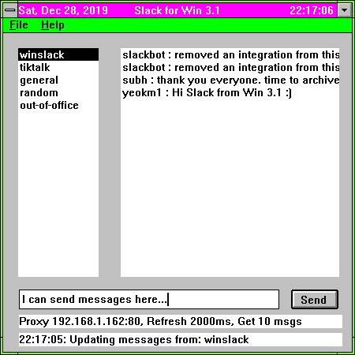
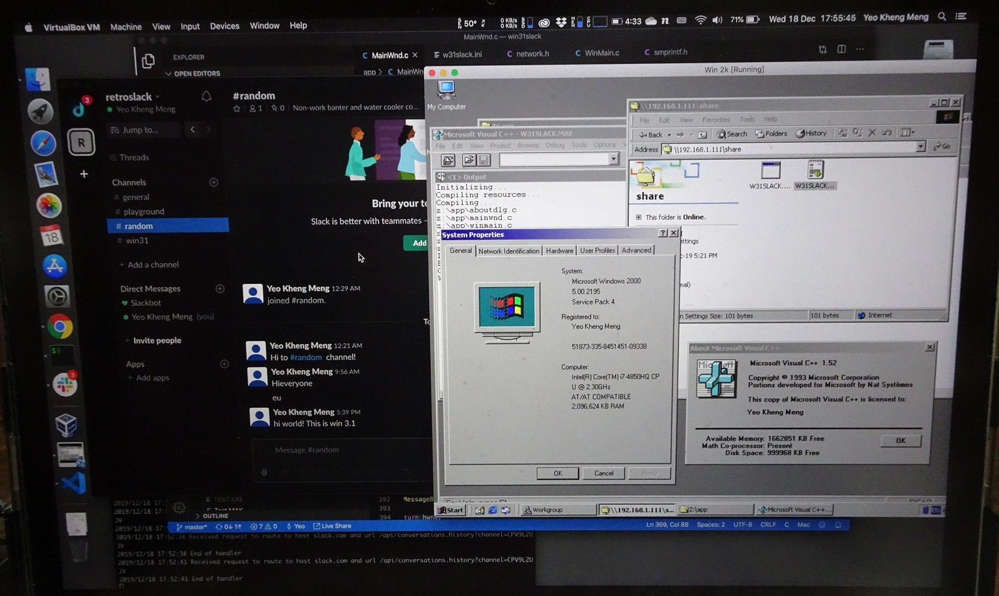
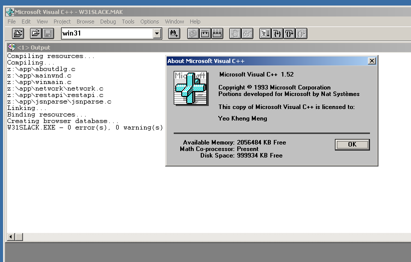
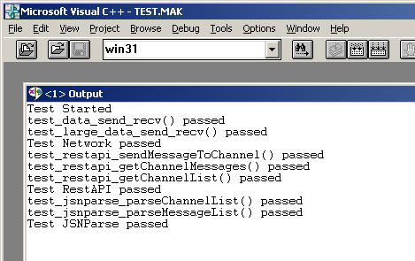

# W31Slack
A proof-of-concept Slack client for Windows for Workgroups (WFW) 3.11 with tests. As there are no native HTTPS APIs for the ancient version of Winsock on WFW, a [HTTP-to-HTTPS proxy](https://github.com/yeokm1/http-to-https-proxy) like this one I've written is needed.

Screenshot of the app

Video of the app in action with a modern Mac Slack client on the side for verification.

# Development and compilation setup

To compile and run the application, you'll need Visual C++ (VC++) 1.52 running on a 32-bit Windows OS up to Windows 10. Windows 3.1 is **not required**. I use a Windows 2000 VM as it is the oldest and lightest 32-bit Windows OS with full Virtualbox support. 

Coding the app can thus be done on a native Mac or Windows OS with modern text editors.

Even though a 16-bit app can run on modern 32-bit OS, I still recommend occasional testing on a native Windows 3.1 system as VMs can be *too perfect* sometimes.

1. Install Windows 2000 VM on a host PC. If you want to share files out of the Win 2K VM, set the network to `Bridged`.
2. Install VC++ 1.52
3. Set up Virtualbox shared folder between the host and Win 2K WM
4. Map a network drive to the local shared folder
5. VC++ 1.52 can see a network drive and open the `w31slack.mak`
6. Just click Project -> Rebuild all.

The `w16slack.exe` binary should be available in the same directory.

## Executing the unit tests

I wrote a custom unit test framework as I could not find a testing framework for C89 that'll work with VC++ 1.52. 2 Go Programs acting as mock servers are required to be run to test the network APIs.

1. `go run mockprox.go` will reply the GET and POST requests by replaying the contents of the `ou*.txt` files.
2. `go run replay.go 30000` will replay whatever was received on a pure TCP socket connection. 
3. Edit the file `tstconst.h` to suit your system especially the `TEST_MOCK_SERVER_IP`
4. Open the file `test.mak`
5. Build Project as per normal and run the binary in debug mode. You'll see the following

# Running the app

1. First [create an app](https://api.slack.com/apps/new) for your associated workspace.
2. Add these permissions to your app `channels:history`, `channels:read`, `chat:write:user`, `groups:history`, `identify`, `im:history`,  `users:read`.
3. Go to "OAuth & Permissions" section and get your OAuth Access Token. The URL should be https://api.slack.com/apps/XXXappIDXXX/oauth?
4. Start up [http-to-https-proxy](https://github.com/yeokm1/http-to-https-proxy)
4. Modify the file `w31slack.ini` configuration file to suit your needs. Fields in this order, token, server polling rate in milliseconds, IP address of proxy, port of proxy.
5. Start up the `w31slack.exe`. The binary and example config file is in the `release` folder.
6. Profit!

# Known issues

1. App may fail if the number of users and channels in the workspace are huge.

# References
1. [Building Win16 GUI Applications in C](http://www.transmissionzero.co.uk/computing/win16-apps-in-c/)
2. [Win16 Example Application](https://github.com/TransmissionZero/Win16-Example-Application)